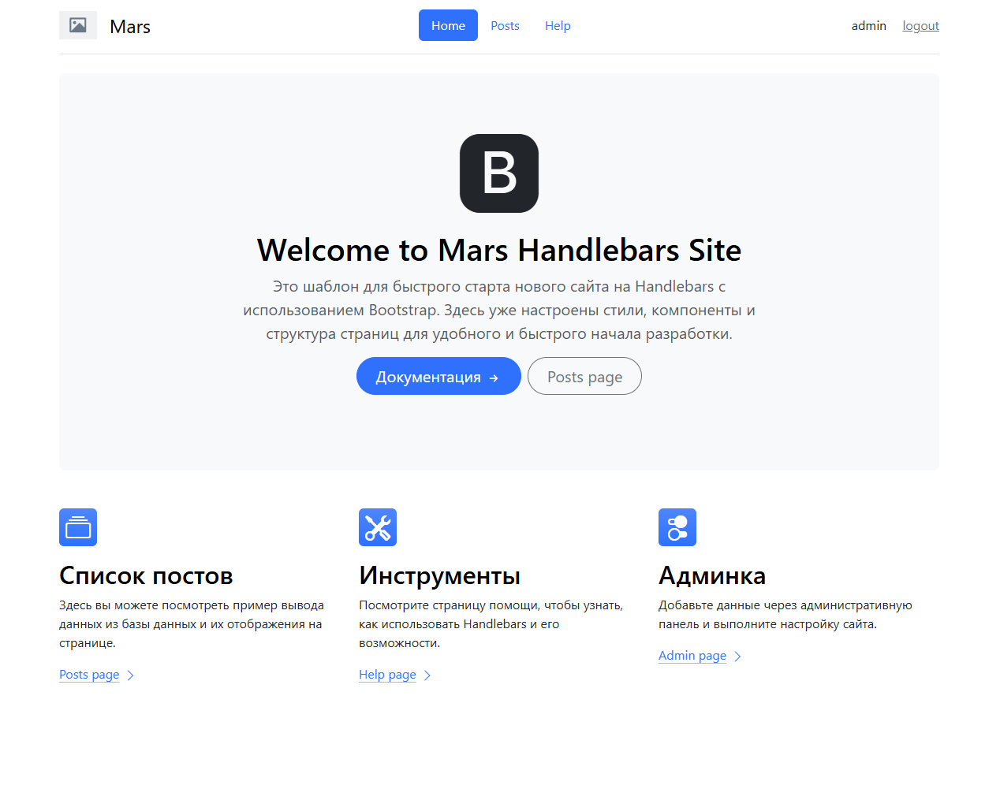

# MyMarsHandlebarsSiteTemplate

<p align="center">
    
</p>

<p align="center">
  <a href="https://www.nuget.org/packages/mdimai666.Mars.Core">
    
  </a>
</p>

Для создания Шаблона сайта для [Mars](https://github.com/mdimai666/Mars)

## Быстрый старт

### 1. Выполните следующую команду в PowerShell для клонирования и автоматической настройки шаблона:

```powershell
# Клонирование и настройка плагина. Используйте слово Plugin в конце
$siteName = "MySite"; git clone https://github.com/mdimai666/MyMarsHandlebarsSiteTemplate.git $siteName; cd $siteName; .\prepare.ps1 $siteName
```

### 2. Настройте Запуск
1. Настройте файл appsettings.local.json
2. или настройте в админке